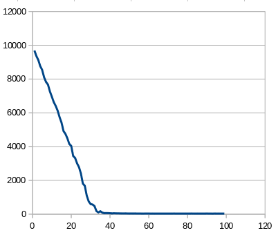
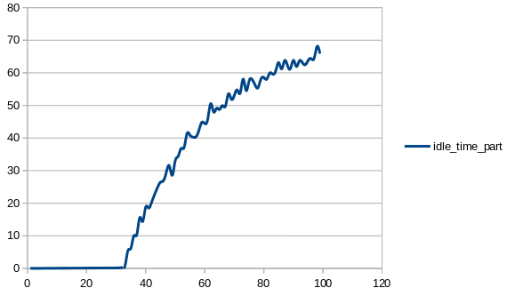
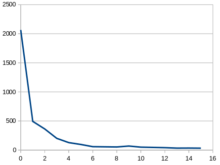

# OS-lab3-scheduler

## Schedulers

The OS maintains all PCBs in Process Scheduling Queues. The OS maintains a separate queue for each of the process states and PCBs of all processes in the same execution state are placed in the same queue. When the state of a process is changed, its PCB is unlinked from its current queue and moved to its new state queue.

The Operating System maintains the following important process scheduling queues −

    Job queue − This queue keeps all the processes in the system.

    Ready queue − This queue keeps a set of all processes residing in main memory, ready and waiting to execute. A new process is always put in this queue.

    Device queues − The processes which are blocked due to unavailability of an I/O device constitute this queue.
### Long Term Scheduler

It is also called a job scheduler. A long-term scheduler determines which programs are admitted to the system for processing. It selects processes from the queue and loads them into memory for execution. Process loads into the memory for CPU scheduling.

The primary objective of the job scheduler is to provide a balanced mix of jobs, such as I/O bound and processor bound. It also controls the degree of multiprogramming. If the degree of multiprogramming is stable, then the average rate of process creation must be equal to the average departure rate of processes leaving the system.

On some systems, the long-term scheduler may not be available or minimal. Time-sharing operating systems have no long term scheduler. When a process changes the state from new to ready, then there is use of long-term scheduler.

### Short Term Scheduler

It is also called as CPU scheduler. Its main objective is to increase system performance in accordance with the chosen set of criteria. It is the change of ready state to running state of the process. CPU scheduler selects a process among the processes that are ready to execute and allocates CPU to one of them.

Short-term schedulers, also known as dispatchers, make the decision of which process to execute next. Short-term schedulers are faster than long-term schedulers.

## Algorithm

We use foreground-background algorithm: there are N queues, new task come in first queue, task with maximal priority is chosen from queue with the smallest number, certain amount of processor time is given to this task, if they can't be finished in time they go into queue N+1, if task is in the last queue enogh time to finish is given.

## Grapghs

#### Average time of waiting by task frequency

#### Part of idle time of waiting by task frequency

#### Average time of waiting by task priority with fixed frequency

